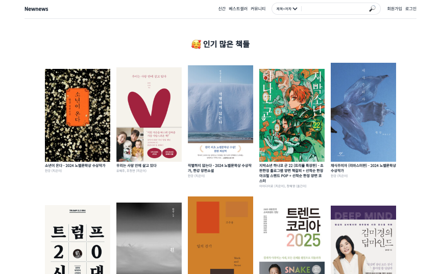
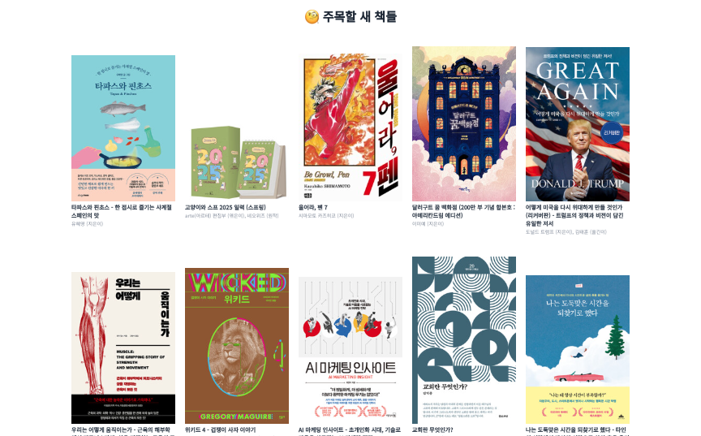
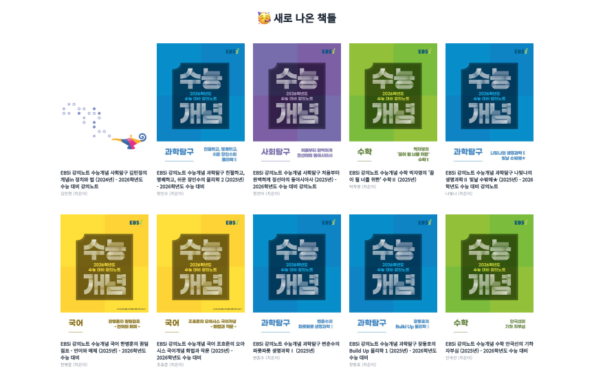
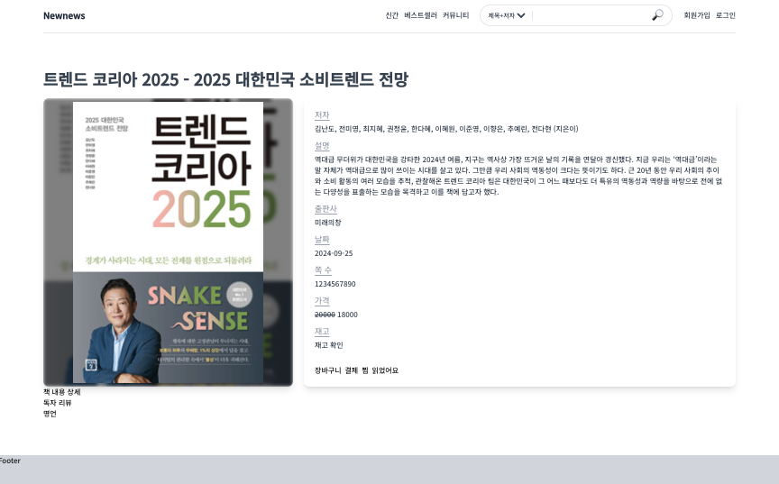
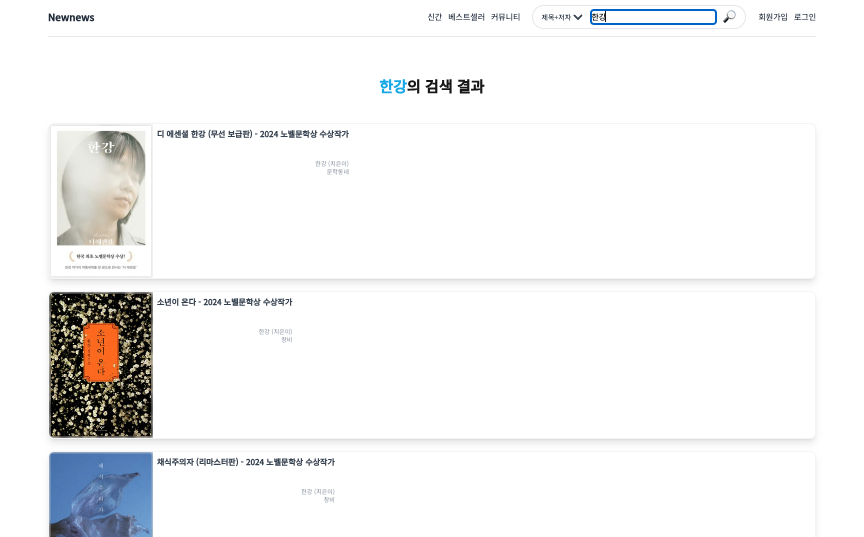

# 뉴뉴스 (Newnews)

## 요약

> 알라딘 Open API를 이용한 책 검색 서비스

## 상세

3번째 PJT

### 0. 목차

1. 소개
2. 기술 스택
3. 느낀 점
4. 기능 (페이지 구성)
5. 아쉬웠던 부분
6. 앞으로 학습할 것들, 나아갈 방향
7. 어려웠던 부분, 해결한 과정

## 1. 소개

**[뉴뉴스 (Newnews)](https://newnews-hee.vercel.app/books)**

**[뉴뉴스 서버 (Newnews Server)](https://github.com/hhejo/newnews-server)**

- 알라딘 Open API를 이용한 책 검색 서비스
- 책 신간, 베스트셀러를 목록으로 조회
- 목록에 출력된 책 중 하나를 선택해 상세정보 조회
- 제목, 저자, 출판사를 검색해 해당 책의 상세정보 조회

작업 기간

- 2024/09, 1주

인력 구성

- 1인

## 2. 기술 스택

### Client

<!-- HTML5 -->
<!--  -->
<!-- CSS3 -->
<!--  -->
<!-- JavaScript -->
<!--  -->

 

  

### Server

  

## 3. 느낀 점

- 더 경험이 쌓이면 CSS를 적용하는 데에 시간이 많이 단축될 것 같음
- 페이지가 늘어날수록 컴포넌트를 분할하고 적용하는 것이 까다로웠음
- 이름을 짓는 것이 은근히 시간이 많이 들고, 보다 더 설명이 잘 되는 이름을 짓기 위해 노력함
- CORS에 대해 자세히 공부할 수 있었고, 웹 페이지를 작업하며 서버를 직접 구현해서 힘들었지만 좋았음

## 4. 기능 (페이지 구성)

### Client

1. Books
   - `/books`
   - 신간, 베스트셀러 목록을 조회하는 페이지
2. Book detail
   - `/books/:id`
   - 선택한 도서의 상세 정보를 보는 페이지
3. Book search
   - 도서 검색 결과를 보여주는 페이지

|                                                                    |                                                                 |
| :----------------------------------------------------------------: | :-------------------------------------------------------------: |
| 베스트셀러 목록 조회  | 주목할 책 목록 조회  |
|       신간 목록 조회         |     상세정보 조회       |
|           검색 결과            |                                                                 |

시연 영상

- `assets` 폴더에 위치

### Server

`Express`를 사용하고 `Heroku`에 배포

- Router를 이용해 페이지별 기능 분할
- CORS Middleware 사용
- `dotenv`를 통해 환경변수를 분리하고 관리
- 각 Router에서 Controller 파일을 따로 분할해 기능 관리
- `Swagger` `YAML`을 이용해 문서화

## 5. 아쉬웠던 부분

- 검색 결과 페이지도 구현하고 싶었는데 시간이 없어 하지 못함. 향후 추가 예정
- TailwindCSS를 적용하는 데 시간을 잡아먹음

## 6. 앞으로 학습할 것들 나아갈 방향

- 서버 구성

## 7. 어려웠던 부분, 해결한 과정

### CSS

- width나 height의 `100%`, `100vw·vh`의 차이
- 요소들의 Flex가 원하는 대로 적용되지 않아 시간을 많이 소모
- 반응형 레이아웃을 제작하는 것이 아직 익숙하지 않음. 많은 연습 필요

### CORS

- 클라이언트에서 로컬로 개발하는 중에, Open API에 연결하려니 CORS 에러 발생
- 서버에서 허용해주지 않고, 브라우저의 정책이기 때문에 JSONP 등의 방법을 사용해봤으나 해결되지 않음
- 프록시 서버로 우회해서 데이터를 받아 해결
- 그러나 프록시 서버의 요청 횟수가 너무 제한되어 결국 따로 Express로 서버를 구성
- 앱 서버가 Open API로 데이터를 받아온 후, 클라이언트에 데이터를 전송해서 해결

### Express

- `index.js`에 모든 코드를 작성했었는데, 프로젝트를 진행할수록 코드 양이 너무 늘어나 관리하는 데에 시간이 점점 늘어남
- 파일로 분리하면 좋을 것 같아 찾아보니, 라우트, 컨트롤러로 로직을 나눌 수 있었음
- 라우트를 파일로 분할하고, 거기에서 컨트롤러도 분리해 라우팅과 비즈니스 로직을 분리해 관리하니 코드를 보고 작성하는 것이 수월해짐
- 향후 DB 연결하는 코드도 잘 분할해서 작성할 예정
- 인증, 실시간 채팅 등도 고민해볼 것
- Open API에 파라미터를 전달하는 데에 `new URLSearchParams()`를 처음 사용해봄

URL 설정에 대한 고민

- `/books/:id`: 더 RESTful하다고 판단
- `/book/:id`

파일 이름

- 파일 이름에 `books.controller.js`처럼 점이 두 개 있는 경우, 가운데 단어는 해당 파일을 설명

가져오기

- `import`로 가져올 때 확장자까지 명시하지 않으면 에러 발생
- TypeScript 환경에서 진행하거나, Babel을 사용하거나, 번들러 등을 사용하면 확장자 없이 가져올 수 있음

### Swagger

- 처음 사용해보는 것이라 설정을 어떻게 할지 몰랐음
- `YAML` 파일에 어떤 식으로 작성해야 할지 헤맸고, 작성할 것이 너무 많았음

### Open API

- 로컬 개발 환경에서 새로고침을 할 때마다 Express 앱 서버에 요청을 하고, 앱 서버는 Open API로 요청을 해서 데이터를 계속 받아옴
- 하지만 Open API는 일일 요청 횟수 제한이 있어 최대한 요청을 하지 않고 데이터를 저장해두고 싶었음
- 간단한 로직 추가로 해결
- 신간 도서 목록을 받아올 때, 이전에 요청했던 시간으로부터 10분이 지났고, `cacheData` 변수에 객체(데이터)가 저장되어 있다면, Open API에 요청하지 않고 저장된 `cacheData` 변수의 값을 클라이언트에게 전송
- Open API에 요청해서 받아온 후, 클라이언트에 응답을 보내는 것보다 `cacheData`가 있으면 바로 보내는 것이 더 빠르게 응답을 보낼 수 있었음
- Open API 요청 횟수도 줄이고, 클라이언트의 반응 시간도 줄여서 좋았음
- 필수 쿼리 줬는데, 선택 쿼리를 주지 않아서 에러가 한번 발생함. 선택 쿼리는 필수가 아닌데 왜 이럴까??
- 받아온 JSON의 맨 끝에 세미콜론이 붙어있어서 `JSON.parse()`가 동작하지 않고 에러가 발생함. 나중에 세미콜론이 있다는 것을 발견해서 맨 뒤 한 문자를 제거함

### Next

- 처음 사용해봐서 적응하는 데에 시간이 걸렸음
- Next.js는 SSR을 구현하기 때문에, 배포를 했다면 Open API를 CORS에 걸리지 않고 받아올 수 있었을 것 같은데, 여기까지 생각이 미치지 못함
- `'use client'`를 어디에서 쓰고, 어디에서는 쓰지 않아야 할지 아직 익숙하지 않음
- `<body>` 태그만 보였는데, `<head>` 태그는 어디에서 수정할 수 있는지 헤매다가 발견함
- 폰트는 어떻게 적용할 수 있는지 공부함. 구글 폰트 설정 완료
- App Router를 사용해서 라우팅을 설정함. React Router보다 더 편했음
- 동적 URL을 전달받을 때, 변수 이름이 바뀌지 않아 헤맸는데 디렉터리 이름이 URL이기 때문에 `[]` 안의 이름을 변경해야 했음
- Next.js 실행하면서 저장하면 버벅이는데 왜 이러는지 모르겠음
- 데이터 페칭 코드를 옮기면 가독성이 좋아지고 관리도 수월하겠다는 생각이 들었음

### Heroku

- 배포할 때 `package.json`의 `scripts`에 `npm start` 스크립트를 작성해야 함. `"start": "node ./index.js"`를 작성해서 빌드 에러 해결
- 포트를 가져와야 함. `const port = 3000`을 `const port = process.env.PORT || 3000`으로 작성해서 503 에러 해결

### Vercel

- Vercel 배포할 때 리포지토리를 선택해서 공개하는 경우 따로 선택을 해줘야 함. 이걸 하지 않아서 깃허브 연결이 되고도 리포지토리를 찾을 수 없었음
